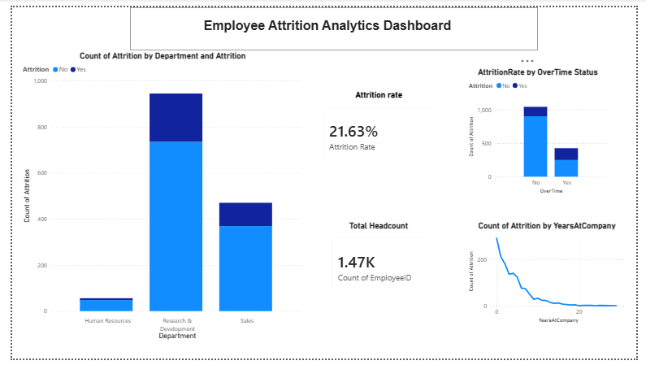
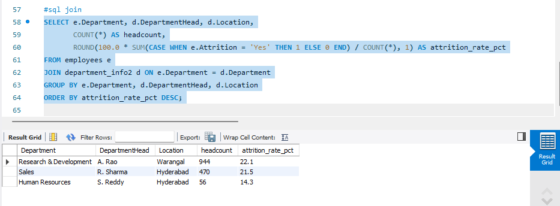

# HR Employee Attrition Analytics
Analysis of 1,470 employee records to identify key drivers of attrition and provide data-driven retention recommendations.

## Tools Used
SQL (MySQL), Python (Pandas), Power BI

## Key Findings
- Employees working overtime leave at a noticeably higher rate than those who don't
- Sales has a disproportionately high attrition rate relative to its headcount
- Attrition is highest in the first 1-2 years, then drops off 
- Extended the analysis with department_info2 table and used SQL JOINs to enrich attrition findings with department leadership and location   context

## Business Recommendations
1. Review workload distribution in overtime-heavy teams to reduce burnout-driven exits
2. Investigate Sales-specific retention drivers (commission structure, manager reviews)
3. Introduce structured onboarding and 90-day check-ins to reduce early-tenure attrition

## Dashboard

📄 [Full Project Documentation (PDF)](project_documentation.pdf)

## Department-Level Analysis (SQL JOIN)

To enrich the attrition analysis beyond single-table aggregation, a `department_info2` reference table was added containing department leadership and location metadata. A SQL JOIN was used to combine this with the main `employees` table, enabling attrition analysis broken down by department head and location — not just department name.

*Query and output showing department-level attrition rate enriched with department head and location via SQL JOIN.*
